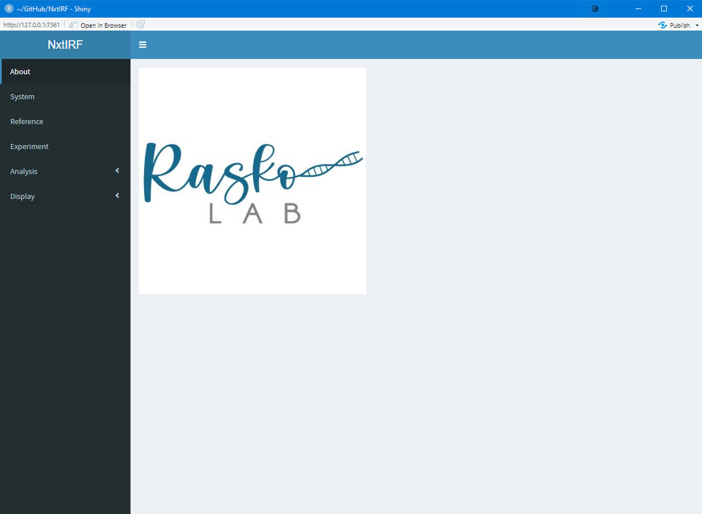
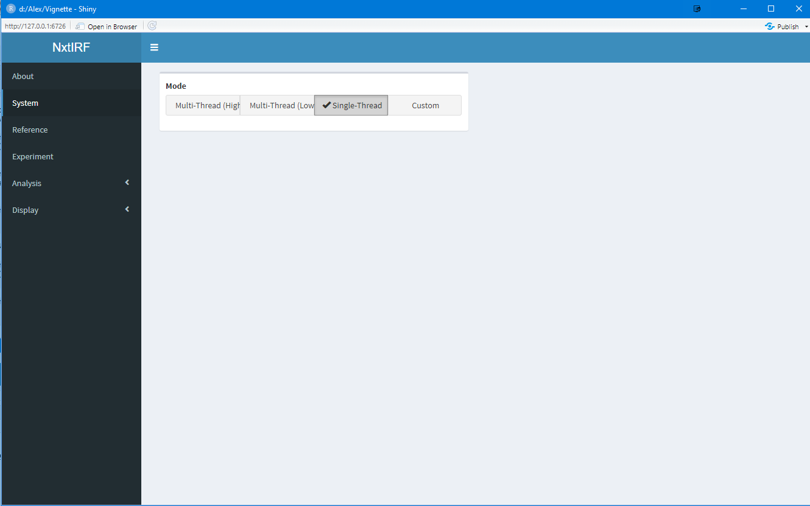

Now that you have built a reference, you can use it to analyse
BAM files of aligned RNA-seq data.

For this vignette, we will download an example dataset. This
dataset contains reads aligned to a 100k region within
Chromosome 9, centered around ANAPC2. Triplicate samples were
treated with or without doxycycline to induce shRNA against a
key splicing factor as described in my PhD thesis.

First, load the NxtIRF package:

```{r, eval = FALSE}
library(NxtIRF)
```

## Download the example dataset

Now, set the working directory to the same working directory
so that the previously build reference can be accessed through
"./Reference". Create a directory to place the sample BAM files:

```{r, eval = FALSE}
dir.create("bams")      # Create the directory to contain the BAM files
download_NxtIRF_example(destination_dir = "./bams")
```

# Using the Command Line Interface

NxtIRF provides convenience functions to identify all files of certain
types inside a parent directory. Here, we will locate all the BAM files
in the directory where we just downloaded the sample files:

```{r, eval = FALSE}
bamfiles.df = Find_Bams("./bams")
```

bamfiles.df contains a data frame with the first column being the sample
names. NxtIRF assumes the files are named by their samples. Sometimes
datasets may choose to use the directory names as their sample names.
In this case, set "use_subdir = TRUE"

```{r, eval = FALSE}
bamfiles.df = Find_Bams("./bams", use_subdir = TRUE)
```

Note that all the sample names are now named by the directory containing
the files. In our dataset, we have named the files by their sample names.
So lets set "use_subdir = FALSE"

```{r, eval = FALSE}
bamfiles.df = Find_Bams("./bams", use_subdir = FALSE).
View(bamfiles.df)   # To view the output of this function in RStudio
```

## Running IRFinder

To run IRFinder, run the following command:

```{r, eval = FALSE}
IRFinder(
    bamfiles = bamfiles.df$BAM, 
    sample_names = bamfiles.df$sample,
    reference_path = "./Reference",
    output_path = "./IRFinder_Output",
    n_threads = 1
)
```

NxtIRF will create the "IRFinder_Output" and run the
IRFinder algorithm to all the provided BAM files using
the reference found in the provided directory containing
the reference.

For those with multi-core systems, feel free to use multiple
threads. NxtIRF will use one core per sample, and processes
the samples in parallel until finished.

Be aware however, for typical RNA-seq files containing
100 million reads, NxtIRF typically use 5-12 Gb of RAM per sample.

## Collating the IRFinder output

After the IRFinder run, the data can be collated into an experiment.
First, we use another convenience function to assemble a data frame
containing the IRFinder output files:

```{r, eval = FALSE}
expr.df = Find_IRFinder_Output("./IRFinder_Output")
View(expr.df)
```

Lets look at the newly created data frame. IRFinder generates two
files per BAM file processed. The file ending in ".txt.gz" contains
the text output of the IR and splice junction quantitation, as well
as the QC parameters. Feel free to use gzip, WinRAR, or other utility
to decompress and view the output files.

The second file is the COV file. This is a binary file format introduced
by NxtIRF to compress data containing read or fragment
coverage for each nucleotide in the aligned genome. We will demonstrate
this in the Visualisation vignette.

For now, lets run CollateData() to assemble all the output files:

```{r, eval = FALSE}
CollateData(
    Experiment = expr.df,
    reference_path = "./Reference",
    output_path = "./NxtIRF_Output",
    IRMode = "SpliceOverMax",       # Use IRMode = "SpliceMax" for legacy IRFinder calculation of IR-Ratio
    low_memory_mode = TRUE,         # Only set to FALSE in large servers with lots of memory
    n_threads = 1
)
```

CollateData creates the "NxtIRF_Output" directory and processes the
output path provided by the "expr.df data frame. The IRMode
is set to "SpliceOverMax" which uses the new approach to count
the total spliced reads associated with each intron, as outlined
in my thesis. For those wishing to use the IRFinder default method,
set IRMode = "SpliceMax".

Note that we set `low_memory_mode = TRUE`. This is not so important
for small numbers of samples, but is required if running large numbers
(more than 16) on a laptop or desktop computer with limited RAM. Low_memory_mode
saves the output of every 16 samples to disk to avoid keeping the
output of the whole experiment into memory. For servers or computers with ample
RAM, feel free to set low_memory_mode = FALSE.

## Assembling the experiment

Now that the IRFinder output has been collated, we are now ready to
assemble it. NxtIRF uses the SummarizedExperiment structure to contain
the data. It also provides the option to assemble the experiment
containing a subset of samples. To do this, we provide a data frame
with the first column containing the sample names that we want to assemble.
We also should provide some annotation as to which samples belong to
which experimental condition. In our example dataset, the "UT" samples are
untreated, whereas the "D2" samples have been treated with doxycycline for
2 days. So lets assemble this data frame:


```{r, eval = FALSE}
colData = data.frame(sample = expr.df$sample)
colData$Treatment = data.table::tstrsplit(colData$sample, split="_")[[1]]
View(colData)
```

Now, we use `MakeSE()` to assemble the SummarizedExperiment.


```{r, eval = FALSE}
se = MakeSE(
    fst_path = "./NxtIRF_Output", 
    colData = colData
)
```

## Filtering for expressed events

Note that se contains more than 400k entries of the 6 samples. This is
because all the IR and alternative splicing events have been included.

To filter for events in expressed genes and transcripts, we use various
expression and QC features. For now, lets use the default filters:

```{r, eval = FALSE}
filters = get_default_filters()

se.filtered = se[apply_filters(se, filters),]
```

For more information regarding the filters, consult the
documentation via `?runFilter()`

Note that `se.filtered` contains less than 1000 entries. These are all
the IR and alternate splicing events that are detected as expressed
by the samples. This reduces issues arising from multiple testing corrections.

## Differential Analysis

Now we are ready to perform differential analysis. Run the following
command:

```{r, eval = FALSE}
res.limma = limma_ASE(
    se = se.filtered,
    test_factor = "Treatment",
    test_nom = "D2",
    test_denom = "UT",
)
```

This command runs differential alternative splicing event (ASE) analysis
on the filtered SummarizedExperiment object. We ask this function to contrast
between the "D2" and "UT" samples in the "Treatment" field.

Feel free to view the `res.limma` output table to view the results. For more
information about this output, refer to `?limma_ASE`

Do not forget to save the results of this data frame. We will save it as a csv file,
as shown:

```{r, eval = FALSE}
data.table::fwrite(res.limma, file = "res.limma.csv")
```

# Graphics User Interface

The example below runs through all the steps outlined in the command line
interface version of the example given above.

Make sure you followed the instruction to download the sample BAM files.

Navigate to the parent directory of the "bams" directory. 
Start the GUI using the following:

```{r, eval = FALSE}
library(NxtIRF)
nxtIRF()
```

```{r, echo=FALSE, out.width='640pt', fig.align = 'center', fig.cap="Title page"}

```

## Setting the number of threads

Before we start, select "System" on the left, then select "Single-Thread" to
run this example in single-threaded mode

```{r, echo=FALSE, out.width='640pt', fig.align = 'center', fig.cap="System"}

```

## Loading the reference and the BAM files

Next, navigate to the `Experiment` tab:

```{r, echo=FALSE, out.width='640pt', fig.align = 'center', fig.cap="Experiment"}
knitr::include_graphics("img/Expr_1_empty.png")
```

Click the pink "Reference" button then click the "Select Reference Path"
button. Follow the dialog box to select the reference directory
containing the reference we build in the Reference vignette.

```{r, echo=FALSE, out.width='640pt', fig.align = 'center', fig.cap="Select Reference Path"}
knitr::include_graphics("img/Expr_2_ref_select.png")
```

If the reference was successfully detected, NxtIRF should look like this,
displaying the properties of the reference that is now loaded:

```{r, echo=FALSE, out.width='640pt', fig.align = 'center', fig.cap="Details of the Loaded Reference"}
knitr::include_graphics("img/Expr_2a_ref_display.png")
```

Click the pink "Reference" button to close the Reference pop-up. Now click the
"BAM Path" button then "Select BAM path" to select the path containing
the downloaded sample BAM files:

```{r, echo=FALSE, out.width='640pt', fig.align = 'center', fig.cap="Select BAM Path"}
knitr::include_graphics("img/Expr_3_bam_select.png")
```

After selecting the bams directory, NxtIRF should show a list of
sample names and associated BAM files. 

```{r, echo=FALSE, out.width='640pt', fig.align = 'center', fig.cap = "List of BAM files"}
knitr::include_graphics("img/Expr_3a_bam_display.png")
```

Note that NxtIRF detects the sample names from the BAM files. If
all the BAM files have the same name, NxtIRF will assume the directory
containing the BAM files are named by sample names. If samples have
identical names, NxtIRF will not be able to process the files.

## Running IRFinder

First we need to create a directory to contain the IRFinder output.
To do this, click the pink "IRFinder" button and
choose the IRFinder output path. You may need to create a new directory
using the dialog box, similar to how you created the "Reference" directory
in the previous vignette.

After you have done this, you are ready to run IRFinder. 
First drag with the mouse to select the cells containing
the file paths of the BAM files. Then click the "Run IRFinder" button.

```{r, echo=FALSE, out.width='640pt', fig.align = 'center', fig.cap="Selecting BAM files to run IRFinder"}
knitr::include_graphics("img/Expr_4_IRF_1.png")
```


A warning popup will ask you to confirm whether to continue running IRFinder. This
is to make sure those planning to run multiple samples on large servers to set
multi-threading options. As we are running small sample files, click the red 
"Run IRFinder" button to continue

```{r, echo=FALSE, out.width='640pt', fig.align = 'center', fig.cap="Confirm to run IRFinder"}
knitr::include_graphics("img/Expr_4_IRF_2.png")
```

When IRFinder is done, a notification popup will show:

```{r, echo=FALSE, out.width='640pt', fig.align = 'center', fig.cap="IRFinder is complete"}
knitr::include_graphics("img/Expr_4_IRF_3.png")
```

Close the IRFinder tab by clicking its pink button.

## Collating IRFinder output

To collate the IRFinder output into one experiment, first we need to assign the
sample annotations. Click the "Annotations" tab above the sample table. This switches
to a different table where you can set sample designations. A box on the left side of
the table will show providing functions to add or remove columns from this new table.

Type in the name of a new column we wish to add: "Treatment", click "character" to tell
NxtIRF the data included here includes letters and numbers, and click "Add" to add this column.

```{r, echo=FALSE, out.width='640pt', fig.align = 'center', fig.cap="Add an annotation column"}
knitr::include_graphics("img/Expr_5_anno_1.png")
```

Once you have done this, assign the treatment annotations to the samples. Write "D2"
in the first 3 cells, and "UT" in the last 3. This is a rHandsOnTable object that
performs basic functions similar to Excel.

```{r, echo=FALSE, out.width='640pt', fig.align = 'center', fig.cap="Annotate your samples"}
knitr::include_graphics("img/Expr_5_anno_2.png")
```

Once this is done, click the "Files" button above the table to close the "Annotation columns"
dialog box. Click the "Construct Experiment" pink button. Then click "Choose NxtIRF FST output path"
and create a new directory to place the output for the collated data. Then run CollateData() by clicking
"Compile NxtIRF FST files".

```{r, echo=FALSE, out.width='640pt', fig.align = 'center', fig.cap="Collating the IRFinder output"}
knitr::include_graphics("img/Expr_6_Collate.png")
```


A progress window on the bottom right corner will display the progress as the data is compiled.
Once this is finished, a popup notification will show. 

```{r, echo=FALSE, out.width='640pt', fig.align = 'center', fig.cap="NxtIRF collation is done!"}
knitr::include_graphics("img/Expr_6_Collate_Done.png")
```

## Loading the SummarizedExperiment object

Congratulations, you have run IRFinder and collated the output. Now all you need to do is
load the data into memory by clicking "Build SummarizedExperiment". When this is done,
all 4 status boxes will turn green.

```{r, echo=FALSE, out.width='640pt', fig.align = 'center', fig.cap="Load the SummarizedExperiment"}
knitr::include_graphics("img/Expr_7_SE.png")
```

## Viewing QC Parameters

Now click the Analysis tab in the navigation panel, then click Experiment QC. A summary table
will show the QC parameters for each sample.

```{r, echo=FALSE, out.width='640pt', fig.align = 'center', fig.cap="QC tab"}
knitr::include_graphics("img/Expr_8_QC_1.png")
```

We can visually compare QC parameters. For example, set the Mode drop-down box to "Graphs",
then set the "X axis" to "depth". A plotly graph shows the sequencing depth of each sample.

```{r, echo=FALSE, out.width='640pt', fig.align = 'center', fig.cap="Read depth per sample"}
knitr::include_graphics("img/Expr_8_QC_2.png")
```

We can also compare one QC parameter against another. For example, we can compare intergenic read
fraction with IRBurden (a parameter that measures global IR). Set the X and Y axes to 
"Intergenic_Fraction" and "IRBurden_clean".

```{r, echo=FALSE, out.width='640pt', fig.align = 'center', fig.cap="Comparisons between two QC parameters"}
knitr::include_graphics("img/Expr_8_QC_3.png")
```

In this case, there is no linear relationship between the fraction of reads mapping to intergenic
regions and IRBurden (global IR). This suggests that the IR is not affected by DNA contamination.

## Filtering IR and Alternative Splicing events

To filter for IR and alternatively splicing events for expressed transcripts, head to the "Filters"
tab in the Analysis navigation section:

```{r, echo=FALSE, out.width='640pt', fig.align = 'center', fig.cap="Filters tab"}
knitr::include_graphics("img/Expr_9_Filter_1.png")
```

This displays a list of empty filters. As a full discussion of filters is beyond the scope of
this vignette, lets load the default filters using the "Load Default Filters" button on the bottom
right. Then, click "Refresh Filters" above the column graph:

```{r, echo=FALSE, out.width='640pt', fig.align = 'center', fig.cap="Loading and running default filters"}
knitr::include_graphics("img/Expr_9_Filter_2.png")
```

Now, it looks like all the events have been filtered out because all the columns are now red.
However, this is not true because the sample BAM files map to a very small region of the genome,
so most events are expected to be filtered out. To view the included events, set the Y scale to
log instead of linear, using the drop-down box located below the graph:

```{r, echo=FALSE, out.width='640pt', fig.align = 'center', fig.cap="Selecing log10 scale"}
knitr::include_graphics("img/Expr_9_Filter_3.png")
```

Feel free to hover the mouse over the columns. The values are given in log-10 scale for Included
events. Note that hovering over the red bars will give the log10(Excluded) - log10(Included) values, rather
than the number of excluded events.

## Differential Alternative Splicing Expression Analysis

We are finally ready to perform differential analysis. Click the "Differential Expression Analysis"
panel from the Analysis drop-down bar. 

```{r, echo=FALSE, out.width='640pt', fig.align = 'center', fig.cap="Differential Expression Analysis tab"}
knitr::include_graphics("img/Expr_10_DE_1.png")
```

For the purposes of this vignette we will use Limma (although using DESeq2 also works). Change the
"Variable" value to "Treatment" to indicate we will perform differential analysis across treatment
conditions. For the nominator, choose "D2", and use "UT" for the denominator. This means that positive
log-fold changes indicate IR is higher in "D2" versus "UT", and vice versa for negative log-fold values.
Leave the "Batch1" and "Batch2" unassigned. The "Multiple Testing" switch should be set to true so
NxtIRF will sort results by adjusted P values. Your settings should like below:

```{r, echo=FALSE, out.width='640pt', fig.align = 'center', fig.cap="Settings to perform differential analysis on D2 vs UT samples"}
knitr::include_graphics("img/Expr_10_DE_2.png")
```

Click "Perform DE" to run the differential analysis. Once this is performed, a results table 
of the differential analysis will be displayed. For more information regarding the columns, refer
to `?limma_ASE`

```{r, echo=FALSE, out.width='640pt', fig.align = 'center', fig.cap="Differential analysis results"}
knitr::include_graphics("img/Expr_10_DE_3.png")
```

To save this table for later use (including visualisation), click "Save DE" and give a file name
for the results. In this vignette, we name this as "limma_results.Rds" for use in the next vignette
which shows the interactive visualisation tools of NxtIRF. See you there!


