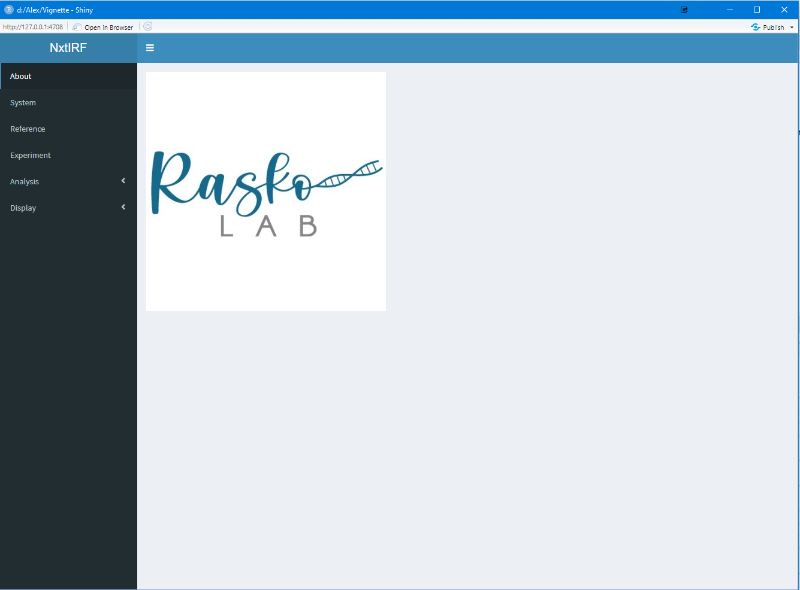
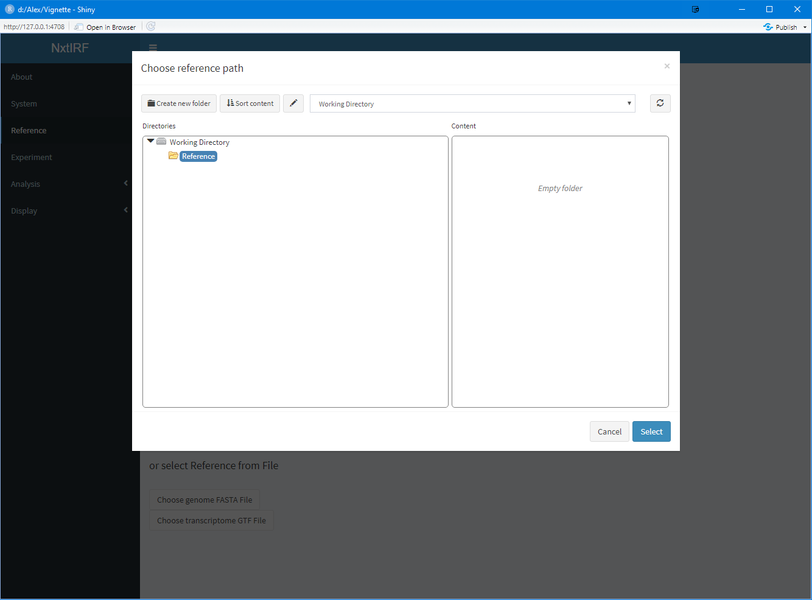
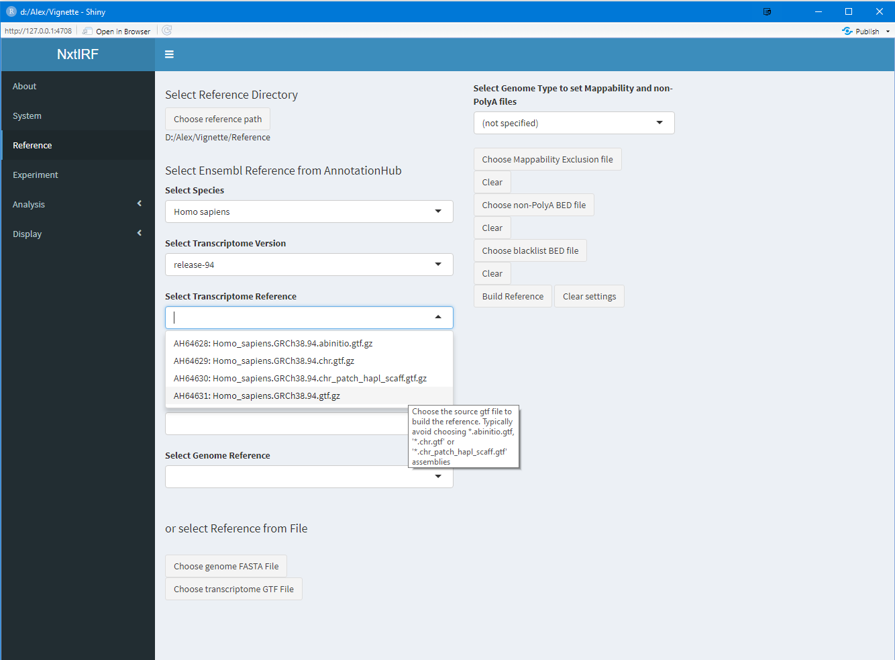

NxtIRF needs to generate a set of reference files in order to 
perform downstream applications including running the IRFinder
algorithm, collating these output files into an experiment, and
drawing visualisation tools. This vignette will show how to
generate a reference using either the command-line interface, or
the graphics user interface (GUI).

# Command Line Interface

First, load the NxtIRF package:

```{r, eval = FALSE}
library(NxtIRF)
```

Next, assign or create a reference directory

```{r, eval = FALSE}
if(!dir.exists("Reference")) dir.create("Reference")
reference_path = "./Reference"
```

NxtIRF can source Ensembl's gene FASTA and GTF data from the
AnnotationHub's repository. We will demonstrate how to find
the desired annotation and generate a reference using the 
human hg38 Ensembl reference (version 94).

```{r, eval = FALSE}
library(AnnotationHub)
ah = AnnotationHub()
ah.options = query(ah, c("Homo Sapiens", "Ensembl", "release-94"))
```
The `query()` function from `AnnotationHub` allows one to
find the relevant annotation using a vector of keywords.
The above query looks for all records with "Homo Sapiens",
"Ensembl" and "release-94" in any of the fields. To view
the list of queried records:

```{r, eval = FALSE}
ah.options
```
Note that AnnotationHub stores FASTA records as 2bit files.
These are compressed FASTA files that we can use. We note that
"AH65745" is the primary assembly FASTA, and that "AH64631" is
the desired GTF file. We note down these records as below:

```{r, eval = FALSE}
ah_genome = "AH65745"
ah_transcriptome = "AH64631"
```

Then, we are ready to build the NxtIRF Reference. Run
the following command:

```{r, eval = FALSE}
BuildReference(
    ah_genome = ah_genome,
    ah_transcriptome = ah_transcriptome,
    reference_path = reference_path,
    genome_type = "hg38")
```

Note that by setting `genome_type = "hg38"`, we are telling
NxtIRF to set the default `nonPolyARef` and `MappabilityRef`
using the included reference files with the `NxtIRF` package.

For more details, see `?BuildReference`

# User-supplied FASTA and GTF files

Alternatively, NxtIRF accepts user-supplied FASTA and GTF files.
Below, we demonstrate how to build the same reference but using
the mouse mm10 default `nonPolyARef` and `MappabilityRef` files:

```{r, eval = FALSE}
fasta = "genome.fa"
gtf = "transcripts.gtf"

BuildReference(
    fasta = fasta,
    gtf = gtf,
    genome_type = "mm10"
)
```

# Generating a custom Mappability Exclusion (ME) file

NxtIRF supplies default ME files based on
version 94 of hg38 and mm10 human and mouse genomes, mapped
using STAR (using read length = 10, read stride = 10 and
threshold = 4). To generate a custom ME file, there are 3
steps:

## 1) Generate Mappability Reads

```{r, eval = FALSE}
run_IRFinder_GenerateMapReads(
    genome.fa = "genome.fa",
    out.fa = "mappability_reads.fa",
    read_len = 70,
    read_stride = 10,
    error_pos = 35
)
```


This step generates a systematic set of reads using the
supplied genome FASTA file. `read_len` specifies the length
of reads being generated, `read_stride` specifies how many 
nucleotides to increment along the genome for each read
(which are generated alternately using positive / negative
strand), and `error_pos` is the position in each read to 
systematically generate a single nucleotide error. This
emulates the procedure of the original IRFinder, in place
of the original PERL scripts used to calculate mappability.

## 2) Align reads to the genome

The resulting output file `mappability_reads.fa` needs to be
aligned back to the same genome. Below is an example of how
to use `STAR` to align the reads. We assume a STAR reference
for the same genome has already been built. The following code
needs to be run on linux command-line:

```{bash, eval = FALSE}
STAR \
    --genomeDir "./STAR_Reference" \
    --genomeLoad NoSharedMemory \
    --runThreadN 8 \
    --outStd SAM \
    --outSAMmode NoQS \
    --outSAMattributes None \
    --outFilterNultimapNmax 1 \
    --readFilesIn "mappability_reads.fa" \
    > "Aligned.bam"
```

## 3) Process aligned reads to evaluate low mappability regions

The final step involves evaluating the aligned reads to identify
regions of low mappability. NxtIRF evaluates this as follows:

```{r, eval = FALSE}
run_IRFinder_MapExclusionRegions(
    bamfile = "Aligned.bam",
    output_file = "MappabilityExclusion.bed",
    threshold = 4,
    includeCov = FALSE
)
```

The above command will output to `MappabilityExclusion.bed` any
region with a coverage of 4 or less. Note that if the region is
uniquely covered, we expect a coverage of 7 (with 70-nt reads of
10 nt stride, we expect 7 reads of coverage per base).

We can then generate the NxtIRF reference using the custom
ME file as below:

```{r, eval = FALSE}
fasta = "genome.fa"
gtf = "transcripts.gtf"
MappabilityRef = "MappabilityExclusion.bed"

BuildReference(
    fasta = fasta,
    gtf = gtf,
    genome_type = "",
    MappabilityRef = MappabilityRef
)
```

NB: If using custom `MappabilityRef` or `nonPolyARef`, make
sure to set `genome_type = ""`.

# Graphics User Interface

Start the GUI using the following:

```{r, eval = FALSE}
library(NxtIRF)
nxtIRF()
```

```{r, echo=FALSE, out.width='640pt', fig.align = 'center', fig.cap="Title page"}

```

Next, navigate to the `Reference` tab:

```{r, echo=FALSE, out.width='640pt', fig.align = 'center', fig.cap="Reference"}

```

Clicking on the `Choose Reference Path` to choose a reference path.
A dialog box will pop up. Select the working directory (which is the
directory set by setwd(). Click "Create new folder" and type in
"Reference" to create this folder in the highlighted path

```{r, echo=FALSE, out.width='640pt', fig.align = 'center', fig.cap="Create a new folder for the Reference"}

```

Now, select the path to the created reference folderon the left hand box, 
and click "Select":

```{r, echo=FALSE, out.width='640pt', fig.align = 'center', fig.cap="Select Reference path dialog box"}

```

Next, we can navigate AnnotationHub's Ensembl database for the Homo
Sapiens release-94 FASTA and GTF files. First, type in `Homo Sapiens`
to filter for species:

```{r, echo=FALSE, out.width='640pt', fig.align = 'center', fig.cap="Select species"}

```

The next drop-down box will be auto-filled using the filtered options.
Select `release-94` to filter for transcriptome GTF annotations belonging
to this release:

```{r, echo=FALSE, out.width='640pt', fig.align = 'center', fig.cap="Select Ensembl release"}

```

Next, select the correct GTF file:

```{r, echo=FALSE, out.width='640pt', fig.align = 'center', fig.cap="Select GTF file"}

```

The FASTA files can be chosen. NxtIRF automatically filters for all
genome files compatible with the chosen GTF file. We select the
FASTA file from the same release as shown:

```{r, echo=FALSE, out.width='640pt', fig.align = 'center', fig.cap="Select FASTA file"}

```

Note that the user can select their own FASTA and GTF files (see below).
In this case, leave the AnnotationHub settings blank:

```{r, echo=FALSE, out.width='640pt', fig.align = 'center', fig.cap="Supply custom FASTA/GTF files"}

```

Finally, set the genome defaults for Mappability Exclusion and non-
PolyA BED files using the genome drop-down box:

```{r, echo=FALSE, out.width='640pt', fig.align = 'center', fig.cap="Select defaults for hg38"}

```

Note that the below fields auto-populate to system-supplied
defaults:

```{r, echo=FALSE, out.width='640pt', fig.align = 'center', fig.cap="Ready to run Reference"}

```

The last step is to click the `Build Reference` button at the
bottom-right area. Note that the progress can be seen in the
bottom-right corner:

```{r, echo=FALSE, out.width='640pt', fig.align = 'center', fig.cap="Running BuildReference"}

```

When this is completed:

```{r, echo=FALSE, out.width='640pt', fig.align = 'center', fig.cap="Reference build complete"}

```

Now you are ready to process the experiment!
